# Chain REAction Tool Environment (CREATE)
[Ayush Jain](http://www-scf.usc.edu/~ayushj/)\*, [Andrew Szot](https://www.andrewszot.com)\*, [Joseph J. Lim](https://clvrai.com) at [USC CLVR lab](https://clvrai.com)  
[[Environment website](https://www.clvrai.com/create)] 

<p align="center">
     <kbd>
          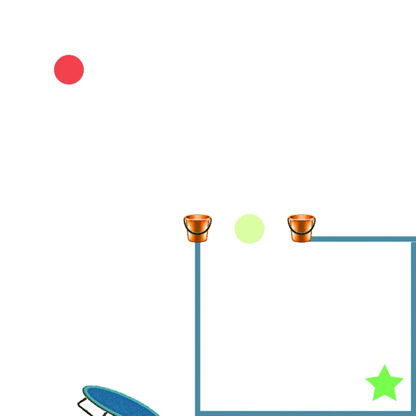
     </kbd>
</p>

**CREATE** is a multi-step physics-based puzzle reinforcement learning benchmark featuring many diverse tools and tasks. The objective is to sequentially select and position tools from an available set, to make the red ball (target) reach the goal (green) in various environment configurations.

Try solving tasks for yourself on the [online demo](https://clvrai.com/create/#demo). Or get started with some [examples](examples).

### Features
- **Multi-step environment**: Agent places a tool after every few iterations of simulation acting on *image* observations. 
- **Easily usable**: Environment is a standard [OpenAI Gym](https://github.com/openai/gym) environment interface. 
- **Diverse Tasks**: 12 complex tasks with stochastic variations and an easy [interface](#5-defining-tasks) to create many more tasks. Suitable for meta reinforcement learning. 
- **Variety of Tools**: 12 base tool types, with many more variations of sizes, angles, friction parameters. 
- **Simple and Fast**: Runs headless and supports flexible resolutions for rendering. 
- **Configurable**: Easily create new levels with a simple JSON interface and create new tools. 

### Relevant Research Areas
- **Reinforcement Learning for Physical Reasoning**: Long-horizon Physics puzzles with diverse interactions. 
- **Generalization to Unseen Actions**: Large and diverse action space to test generalization. 
- **Multi-task Learning**: Diverse task distribution suitable for meta learning. 
- **Predictive Modeling and Model-based RL**: Consistent environment and tool dynamics for learning models. 
- **Tool functionality and usage**: Discrete (selection) + Continuous (placement) action space for tools.


## (1) Usage
`import create_game` to register the environments. From here, create the gym environment using the standard command: 
`gym.make('CreateLevelPush-v0')` with the name of the task you want to use.
CREATE comes with [12 diverse tasks](#6-included-tasks) and you can easily
create more using the simple JSON definition system. Below is an example of how
it is easy to get started with the environment. 
```
import create_game

env = gym.make('CreateLevelPush-v0')

env.reset()

done = False
while not done: 
    obs, reward, done, info = env.step(env.action_space.sample())
    env.render('human')
```

By default stochasicity is applied in the default environments. If you want to use deterministic configurations, specify `Det` after the name of the level like: `gym.make('CreateLevelPushDet-v0')`. 

See [`examples/random_agent.py`](examples/random_agent.py) for an example with using a random agent on the environment. This environment also works well with multi-processing, and the simulation is optimized for high training speeds. If you wish to work with variable action spaces please see [`examples/var_action.py`](examples/var_action.py) for how to get started.

For a performance comparison to the method from our paper, use the evaluation script at [`examples/evaluation.py`](examples/evaluation.py). Change the evaluation script to include your models to assess their performance on the test set of tools.

<br>

## (2) Installation
This project only works with Python 3.6+. Clone this repository, pip install the
requirements and then move the `create_game` folder to where you want to use
it. All of the code for the environment is in this folder.
```
git clone https://github.com/gitlimlab/CREATE.git
cd CREATE
pip install -r requirements.txt
```

<br>

## (3) Multi-Task
See [`examples/multi_task.py`](examples/multi_task.py) for a complete example. 

<br>

## (4) Game Configuration
See [`create_game/settings.py`](create_game/settings.py) for a list of all
possible settings that can be changed about the game play, rendering, reward
structure and simulation. Configure the environment as:
`env.set_settings(CreateGameSettings())` and specify your settings in
`CreateGameSettings()`.

<br>

## (5) Defining Tasks
See [`examples/create_task.ipynb`](examples/create_task.ipynb) for an example on how to define custom tasks. 

You can also create custom tasks in CREATE with ease. Simply define the task 'ABC' in JSON and you can use it as `CreateLevelABC-v0`. 
An example JSON definition of `Moving` task is shown below: 
```
{
     'name' :  'Moving' ,
     'target' :  '[0.6, 0.75]',
     'goal' :  '[-0.7, 0.0]',
     'moving_goal' : true,
     'rnd' : {
         'target' :  '[uniform(-0.2, 0.2), uniform(-0.2, 0.2)]',
         'goal' :  '[0., uniform(-0.5, 0.5)]' 
    },
    'env' : [
        {
             'name' :  'trampoline',
             'pos' :  '[-0.7, -0.75]' ,
             'id' : '1',
             'elasticity' : '1.0'
        }
    ]
}
```

You can register this JSON file as a gym environment by calling `register_json_folder(...)` passing the name of the folder the JSON files are in. Individual tasks can be registered using `register_json_str(...)`. 

<!--- (We start by defining the name of the level ('Moving') specify the initial position of the target ball and goal location. The 'rnd' section defines the stochasicity of the starting position for both the target and goal in the scene. In the 'env' section we define all the objects that are in the scene. We would load the level by specifying `gym.make('CreateLevelMoving-v0')` Here are a complete list of options we can specify for the top level fields:-->

Screen's coordinate system is centered at (0,0) and both axes lie in [-1, 1]. Top-left corner has coordinate: (1, 1).

Complete list of options we can specify for the top level fields:
- `name`: name of the task. This corresponds to the name of the environment when loading with gym. 
- `target`: position of the target ball.
- `goal`: position of the goal location or ball.
- `moving_goal`: `true` for physically movable goal ball. `false` for a static star-shaped goal.
- `rnd`: specifies stochasticity for each object in the environment. Identical randomness can be applied to multiple objects by having two names in the field as: 
  ```
  'goal,medium_floor:1' :  '[uniform(-0.2, 0.2), uniform(-0.2, 0.2)]'
   ```
   This adds a random variation in [-0.2, 0.2] to each coordinate of `env` object 'medium_floor' with ID 1 and the goal object. This can be useful if a platform-object pair stay together and need to be stochastically initialized.  
- `env`: all the initial environment objects are defined here. See [complete list of available objects](create_game/tools/tool_factory.py#L37). You can also specify parameters to these objects such as 'elasticity', 'length' or 'angle' as found in their [individual files](create_game/tools). ID is used by `rnd` to distinguish objects having same name.


```
from create_game import CreateGameSettings
import gym

env = gym.make('CreateLevelPush-v0')
env.set_settings(CreateGameSettings(max_num_steps=5, action_set_size=10))
```

<br>

## (6) Included Tasks

| Task Description  | Task Example | Task Description  | Task Example |
| ------------- | ------------- | ------------- | ------------- |
| Basket (`CreateLevelBasket`)  | 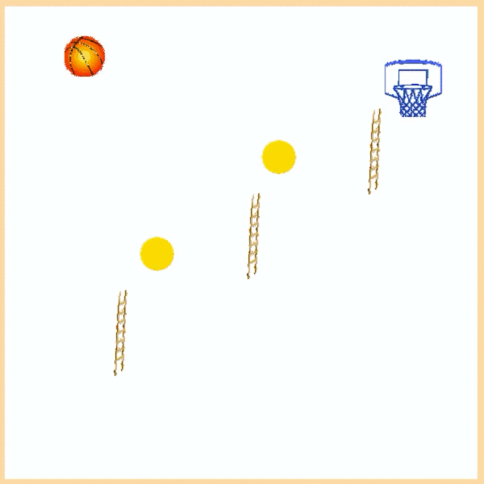  | Belt (`CreateLevelBelt`)  | 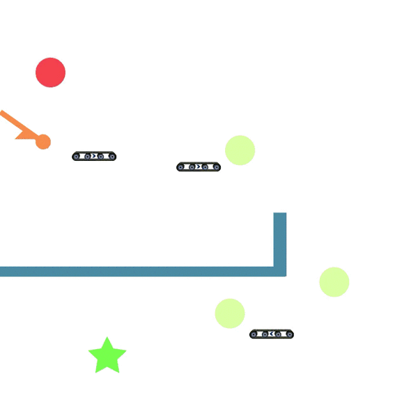  |
| Buckets (`CreateLevelBuckets`)  | 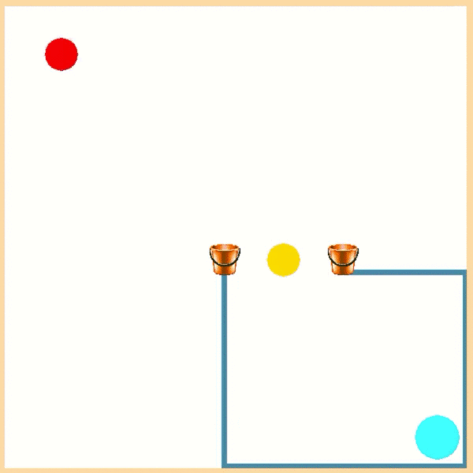  | Cannon (`CreateLevelCannon`)  | 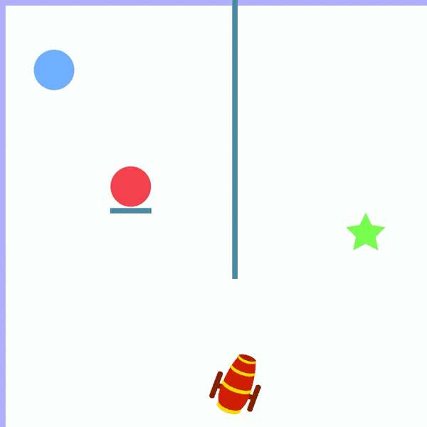  |
| Collide (`CreateLevelCollide`)  |   | Ladder (`CreateLevelLadder`)  | 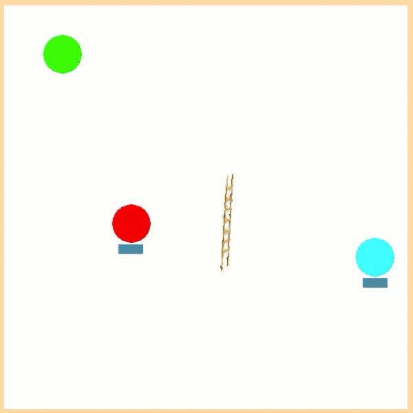  |
| Moving (`CreateLevelMoving`)  | 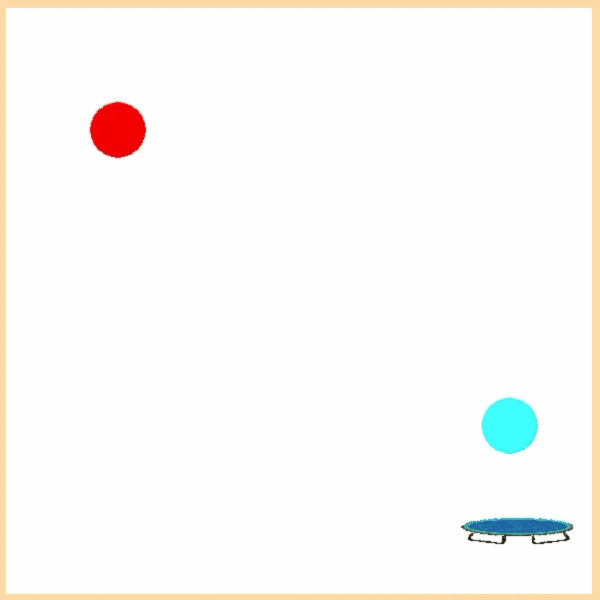  | Navigate (`CreateLevelNavigate`)  | 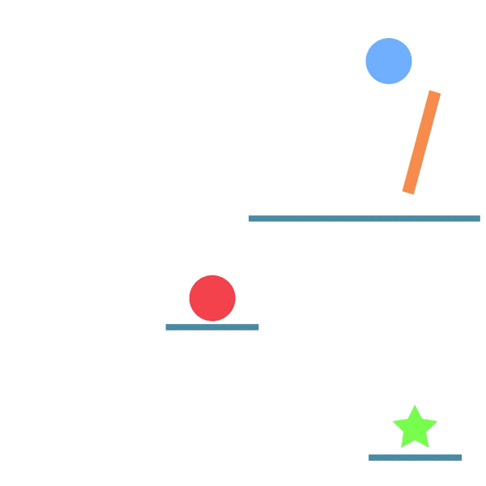  |
| Obstacle (`CreateLevelObstacle`)  | 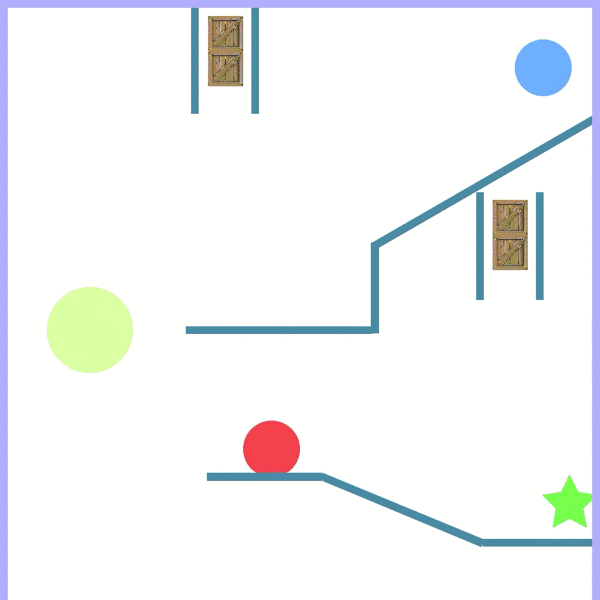  | Push (`CreateLevelPush`)  | 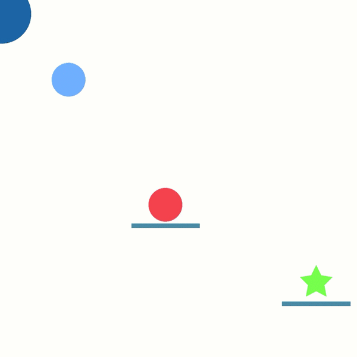  |
| Seesaw (`CreateLevelSeesaw`)  | 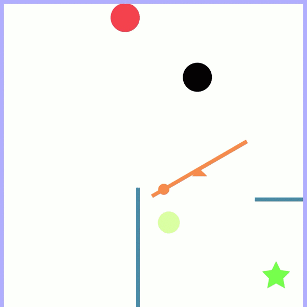  | Funnel (`CreateLevelFunnel`) | 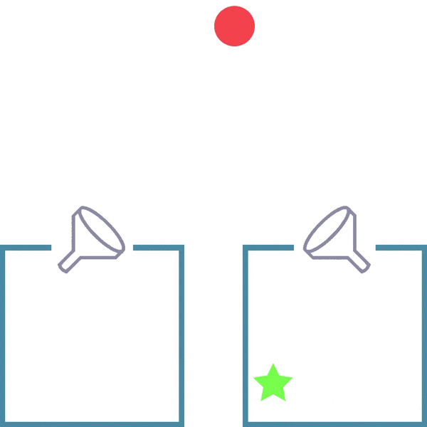  |

<br>

## (7) References
Our environment is based on Pygame and Pymunk libraries:
- Pygame: https://www.pygame.org/docs/
- Pymunk: http://www.pymunk.org/

<br>

## (8) Citation
If you find this work useful in your research, please consider citing:
```
@InProceedings{pmlr-v119-jain20b,
  title = 	 {Generalization to New Actions in Reinforcement Learning},
  author =       {Jain, Ayush and Szot, Andrew and Lim, Joseph},
  booktitle = 	 {Proceedings of the 37th International Conference on Machine Learning},
  pages = 	 {4661--4672},
  year = 	 {2020},
  editor = 	 {III, Hal Daumé and Singh, Aarti},
  volume = 	 {119},
  series = 	 {Proceedings of Machine Learning Research},
  month = 	 {13--18 Jul},
  publisher =    {PMLR},
  url = 	 {https://proceedings.mlr.press/v119/jain20b.html}
}

```
