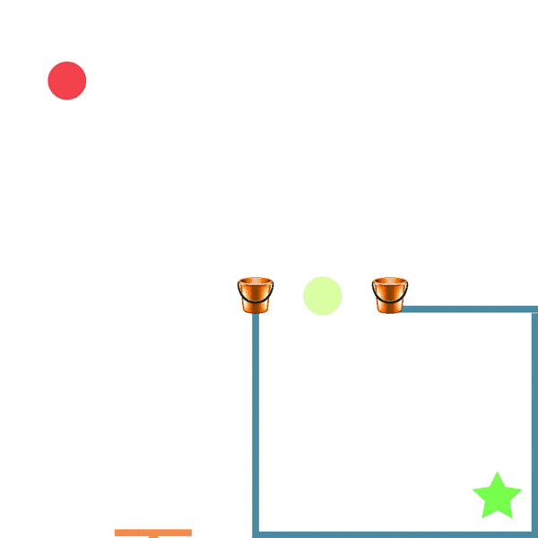
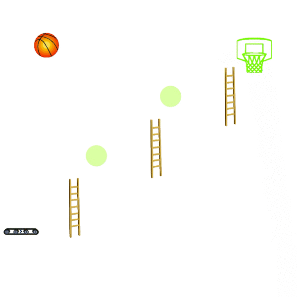
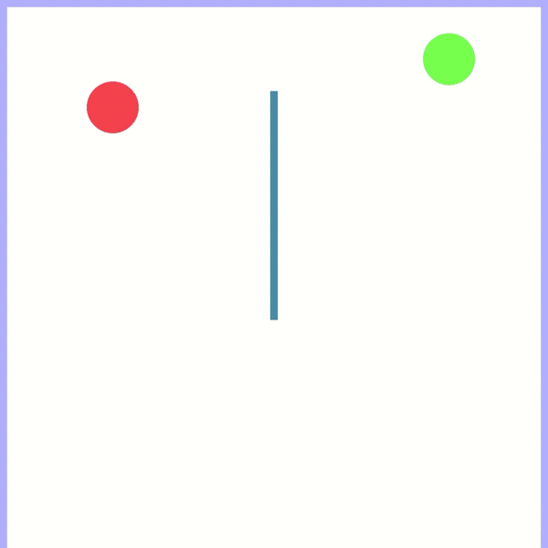
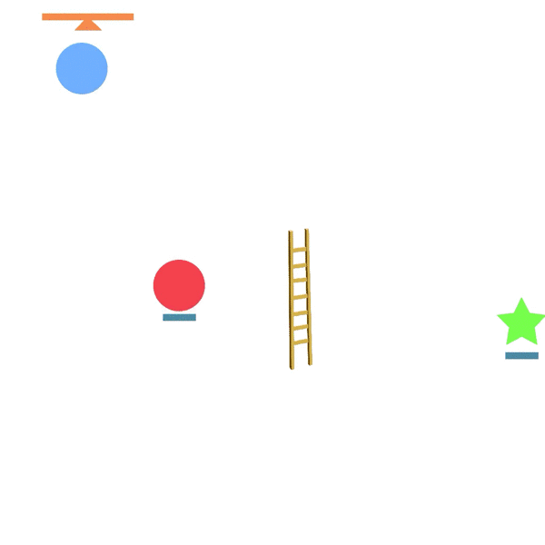

# Chain REAction Tool Environment (CREATE)


|   |   |   |   |

CREATE is a multi-step physics based puzzle reinforcement learning benchmark featuring many diverse tools. The goal of the game is to get the red ball (the target ball) to the blue ball (the goal ball). The agent must select which tool to place and where to place it. To solve the task multiple tools need to be placed. 

This environment is a simple Gym interface and is easy to use with RL and meta-RL methods. 10 challenging tasks are included by default and it is easy to define your own. Likewise, 20 distinct tool types are included each with more variations of sizes, angles, friction parameters.

Try solving tasks for yourself on the [online demo](http://lim-e.usc.edu:8080/create/). Or get started with some [examples](https://github.com/gitlimlab/CREATE/tree/master/examples).

This environment was created to encourage research on the following areas: 
- Tool usage in reinforcement learning. The environment can be configurated to
  have how ever many tools available. Agents must reason about which tool is
  appropriate for the current state and the desired usage or `x,y` position to
  place the tool at. 
- Multi-step reinforcment learning in precise physics based environments. All
  of the 10 levels require solving the task through different physical
  phenomina. 
- Task generalization. Generalizing between the 10 tasks provided presents a
  challenge for current RL methods. Each task can generate further
  configurations of the same randomized subtask and it is also easy to define
  your own tasks. 


## Usage
This environment conforms to the standard [OpenAI Gym](https://github.com/openai/gym) environment interface. Simply `import create_game`
to register to the environment. Then create the gym environment using the
standard command: 
`gym.make('CreateLevelPush-v0')` with the name of the task you want to use. CREATE features 10 diverse default tasks which can be seen in the "Included Tasks" section. You can easily create more using the simple JSON definition system. 
Some level of stochasicity is applied in all of the default environments. If you don't want to use any stochasicity specify `Det` after the name of the level like: `gym.make('CreateLevelPushDet-v0')`. 

See `examples/random_agent.py` for an example with using a random agent on the
environment. 

## Installation

IN THE FUTURE: Simply `pip install create-rl`.

For now: clone this repo and `pip install -r requirements.txt` from this repo. 

## Defining Tasks
You can also create custom tasks in CREATE with ease. Simply define the level in JSON and you are good to go. 
An example JSON definition of a task is shown below: 
```
{
     'name' :  'Moving' ,
     'target' :  '[0.6, 0.75]',
     'goal' :  '[-0.7, 0.0]',
     'moving_goal' : true,
     'rnd' : {
         'target' :  '[uniform(-HIGH_NOISE, HIGH_NOISE), uniform(-HIGH_NOISE, HIGH_NOISE)]',
         'goal' :  '[0., uniform(-LARGE_NOISE, LARGE_NOISE)]' 
    },
    'env' : [
        {
             'name' :  'trampoline',
             'pos' :  '[-0.7, -0.75]' ,
             'id' : '1',
             'elasticity' : '1.0'
        }
    ]
}
```
You can register this JSON file as a gym environment by calling `register_json_folder` passing the name of the folder the JSON files are in. You can also call `register_json_str` to register just one task defined as a string. See [here](https://github.com/gitlimlab/CREATE/blob/master/examples/create_task.ipynb) for an example. 

We start by defining the name of the level ('Moving') specify the initial position of the target ball and goal location. The 'rnd' section defines the stochasicity of the starting position for both the target and goal in the scene. In the 'env' section we define all the objects that are in the scene. We would load the level by specifying `gym.create('CreateLevelMoving')` Here are a complete list of options we can specify for the top level fields:
- `name`: name of the task. This will determine the load name of the task as well. 
- `target`: position of the target ball.
- `goal`: position of the goal ball.
- `moving_goal`: `true` if the goal should act as a ball with mass and be able to be moved. If false, the goal does not interact with anything. 
- `rnd`: The stochasicities for the each object in the level. Note that stochasicity can be applied to multiple objects in the scene at the same time through specifying two names in the field as: 
  ```
  'goal,medium_floor:1' :  '[uniform(-HIGH_NOISE, HIGH_NOISE), uniform(-HIGH_NOISE, HIGH_NOISE)]'
   ```
   This stochasicity is then applied the same to the env object with name 'medium_floor' with ID 1 and the goal object. This is useful if you have a platform below a object you want to be randomly initialized and you want to move them together.  
- `env`: Where all of the environment objects are defined. See [this location in the code](https://github.com/gitlimlab/CREATE/blob/2b68ffcdcc6d03fa0cfcae97963f2576d233c9ff/create_game/tools/tool_factory.py#L37) for the complete list of possible objects. You can also specify parameters to this object such as 'elasticity', 'length' or 'angle'. You can also specify an ID to reference in the rnd noise. 


## Included Tasks

| Task Description  | Task Example |
| ------------- | ------------- |
| Basket (`CreateLevelBasket`)  |   |
| Basket (`CreateLevelBuckets`)  |   |
| Basket (`CreateLevelCollide`)  |   |
| Basket (`CreateLevelObstacle`)  |   |
| Basket (`CreateLevelLadder`)  |   |
| Basket (`CreateLevelMoving`)  |   |
